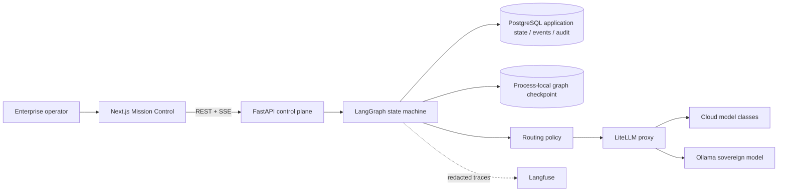

# Enterprise Sovereign AI Decision Matrix

An enterprise AI orchestration control plane with a fully functioning reference workflow,
deterministic showcase mode, sovereign routing, Human-in-the-Loop governance, and auditable
decision lineage. It is an operations console—not a chatbot or a general-purpose enterprise
platform.

## Why this matters

Enterprises need to know **which model handled data, why it was selected, what it cost, which agent changed state, and who authorised high-risk action**. This project makes those decisions explicit, testable, observable, and reproducible while ensuring restricted workloads cannot silently escape to a cloud model.

## Capabilities

- Synthetic **EU Critical Infrastructure Change Assessment** with typed state, explicit transitions,
  deterministic domain assessments, challenge analysis, and one real routed model invocation.
- Real LangGraph interruption and `Command(resume=...)` continuation for approval and rejection.
- Sovereignty-aware `FAST`, `BALANCED`, `REASONING`, and `SOVEREIGN` routing; sensitive traffic fails closed.
- FastAPI REST control plane with immediate queued creation, process-local background execution,
  monotonic replayable SSE telemetry, heartbeats, correlation IDs, and immutable audit events.
- PostgreSQL production persistence and deterministic fake inference for zero-cost tests.
- Next.js operational shell with a phase-by-discipline Decision Matrix, deep-linked Runs, Run
  Detail, Governance, Observability/Audit, Architecture Proof, inspector, event lineage, and an
  accessible approval interceptor.
- A Decision Theatre conversation feed: each visible agent-to-agent handoff is emitted and
  persisted by the backend event contract, carries evidence references, and is labelled synthetic.
- LiteLLM gateway, compact Ollama inference, and failure-isolated Langfuse instrumentation.
- Hardened, non-root first-party containers, private infrastructure services, GitHub CI, and Cloudflare Tunnel deployment.

## Architecture



The workflow is a fixed sequential topology: intake and system scoping; sensitivity, threat and
budget classification; triage; architecture, routed risk, compliance, FinOps and resilience
assessment; challenge; policy; optional approval interrupt; and finalise/reject. LLM output
supplies analysis, never arbitrary topology. The sequential topology is intentional and no
fan-out/concurrency claim is made. See [architecture](docs/architecture/ARCHITECTURE.md),
[domain model](docs/architecture/DOMAIN_MODEL.md), and
[state machine](docs/architecture/STATE_MACHINE.md).

## Quick start

### Requirements

- Docker Engine with Compose v2
- Recommended demo host: 4 CPU cores, 16 GB RAM, and 30 GB free disk
- CPU-only operation is supported; local inference can be slow

```bash
git clone <repository>
cd enterprise-sovereign-ai-matrix
cp .env.example .env
# Replace every change-me value with: openssl rand -hex 32
docker compose build
docker compose up -d
docker compose ps
```

Open Mission Control at <http://localhost:3000>, the API at <http://localhost:8000/api/docs>, and local Langfuse at <http://localhost:3001>. Pull the compact sovereign model once with:

```bash
docker compose exec ollama ollama pull qwen2.5:1.5b-instruct-q4_K_M
```

No commercial key is required for deterministic demonstration mode or the test suites. Cloud routes are opt-in through environment variables; `RUN_LIVE_LLM_TESTS=false` is the default.

## Two-minute guided demonstration

Open the Command Centre, launch the prefilled high-risk synthetic EU change, inspect the real route
and event-backed task cards, decide at the backend HITL gate, then follow the execution deep link
and Architecture Proof. The exact narrative is in the
[recruiter demo script](docs/showcase/RECRUITER_DEMO_SCRIPT.md). Mission Control also offers SAFE,
SENSITIVE, PROVIDER_FAILURE, TIMEOUT, and MALFORMED_RESPONSE deterministic scenarios. To exercise
governance from a terminal:

```bash
./scripts/demo-smoke-test.sh http://localhost:8000
```

The script creates a high-risk execution, confirms it reaches `WAITING_APPROVAL`, approves it, and verifies completion. In the UI the same path opens an approval interceptor showing risk, evidence, recommendation, and operator-reason controls. Rejection follows a distinct audited abort path.

### Decision Theatre and OSINT boundary

The Command Centre is an **OSINT-style decision theatre**, not an internet-collection platform.
As real graph nodes complete, the backend persists concise handoffs between specialist roles; the
conversation window streams those exact events and their evidence references. It never invents
chat messages in the browser. The current showcase analyses synthetic supplied context and does
not yet crawl the web, query paid data sources, resolve real entities, or claim access to
confidential intelligence. Those collection connectors require separately governed provenance,
licensing, robots/terms, retention and source-reliability controls.

## Sovereign routing and observability

PII, restricted, and residency-constrained requests route only to the `sovereign` LiteLLM alias backed by Ollama. If that provider is unavailable, policy raises a typed failure rather than falling back to cloud. Public workloads select cost/criticality-appropriate classes.

Every execution carries an execution ID, correlation ID, and trace reference. Agent transitions record latency, tokens, estimated EUR cost, model class, and provider. Raw sensitive content is redacted before best-effort Langfuse export; observability failure never corrupts workflow state.

## Development and validation

```bash
make setup
make lint
make typecheck
make test
make build
make smoke
make security
make ci
```

Backend and frontend tests use deterministic mocks and never make paid LLM calls. CI separates backend, frontend, integration, Docker, and supply-chain checks. Consult the [test strategy](docs/testing/TEST_STRATEGY.md) and the truthful [validation report](docs/VALIDATION_REPORT.md) for executed checks and environment limitations.

## Deployment

The Compose stack includes web, API, PostgreSQL, LiteLLM, Ollama, Langfuse, ClickHouse, Redis, and object storage with health checks and named volumes. Only web/API ingress and loopback Langfuse are published; databases, gateway administration, and inference remain private.

- [Local development](docs/operations/LOCAL_DEVELOPMENT.md)
- [Hetzner-compatible deployment](docs/operations/DEPLOYMENT.md)
- [Guida completa al deployment di produzione (italiano)](docs/operations/PRODUCTION_DEPLOYMENT_GUIDE_IT.md)
- [Cloudflare Tunnel and `matrix.neuromorphicinference.com`](docs/operations/CLOUDFLARE.md)
- [Troubleshooting](docs/operations/TROUBLESHOOTING.md)

Cloudflare Tunnel can present the direct subdomain or an explicitly allow-listed iframe parent without globally weakening frame policy. DNS ownership and production credentials remain operator-controlled external actions.

## Security and cost

Secrets are environment-only; mutations are rate-limited; CORS and security headers use explicit policies; sensitive telemetry is redacted; containers drop capabilities; internal services have no public ports. This is a flagship PoC rather than a multi-tenant IAM product—place it behind Cloudflare Access for public use. Review [SECURITY.md](SECURITY.md) and the [threat model](docs/security/THREAT_MODEL.md).

The project hard cap is **EUR 250**. Open-source software, deterministic CI, a compact local model, and a small European VPS keep the expected showcase cost below that limit. See the [budget ledger](docs/finops/BUDGET.md) and [cost model](docs/finops/COST_MODEL.md).

## Showcase evidence and limitations

The runnable dashboard is the canonical demo. Deterministic evidence belongs in
`docs/showcase/screenshots/`; the current environment had no browser binary and external access
was blocked, so this branch does not misrepresent an unrendered image as a validated screenshot.
See the [visual QA report](docs/design/VISUAL_QA_REPORT.md) and
[requirements traceability](docs/design/REQUIREMENTS_TRACEABILITY.md).

Current limitations are deliberately explicit: the executor is process-local rather than a
distributed/restart-safe queue; LangGraph uses `InMemorySaver`; only fake inference can be
deterministically replayed to an interrupted state after restart and live-provider replay fails
closed; CPU-only sovereign inference has higher latency; production authentication is delegated
to Cloudflare Access; commercial provider behaviour requires opt-in credentials; and the full
observability stack has a larger memory footprint than the application-only profile. See
[release readiness](docs/RELEASE_READINESS.md).

## Roadmap

1. Add organisation-scoped RBAC and signed operator identities.
2. Add PostgreSQL row-level tenancy and retention controls.
3. Benchmark additional compact sovereign models and vLLM migration.
4. Add production load/chaos runs and browser E2E evidence in deployment CI.

Licensed under the [MIT License](LICENSE). Contributions follow [CONTRIBUTING.md](CONTRIBUTING.md).
