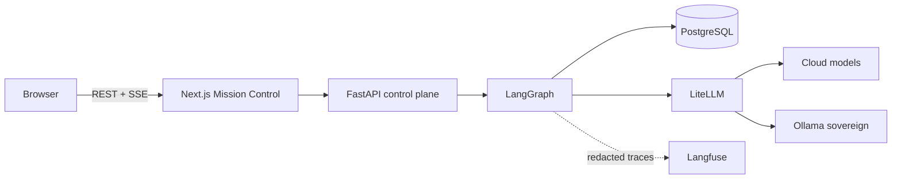

# Architecture

Mission Control uses REST for commands and reconnecting SSE for telemetry. FastAPI owns execution authorisation and invokes a deterministic LangGraph state machine. PostgreSQL holds application state, append-only audit records and replayable events. The LangGraph checkpointer is currently process-local memory: after restart only deterministic fake inference can be replayed to the interrupt with observer side effects suppressed; live-provider replay fails closed. Domain agents request model classes through one inference interface; LiteLLM maps those classes to configured providers. Restricted data selects Ollama and has no cloud fallback. Langfuse receives redacted, correlated traces on a best-effort boundary.

The public edge exposes only the web application and API. PostgreSQL, LiteLLM, Ollama, ClickHouse, Redis and object storage remain on an internal Docker network.
