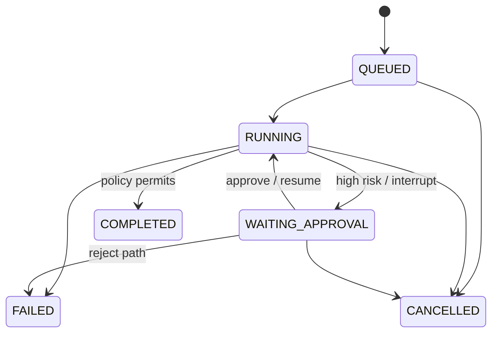

# State machine

The fixed graph expands intake, classification and deterministic domain assessments around one
routed risk-model invocation, then performs challenge and policy evaluation before an approval
interrupt when required and finalise or reject. LLM output supplies evidence, never topology.
Terminal states cannot transition. Approval is accepted only at `WAITING_APPROVAL`; LangGraph's
process-local checkpoint and command-resume primitive is the execution mechanism.
