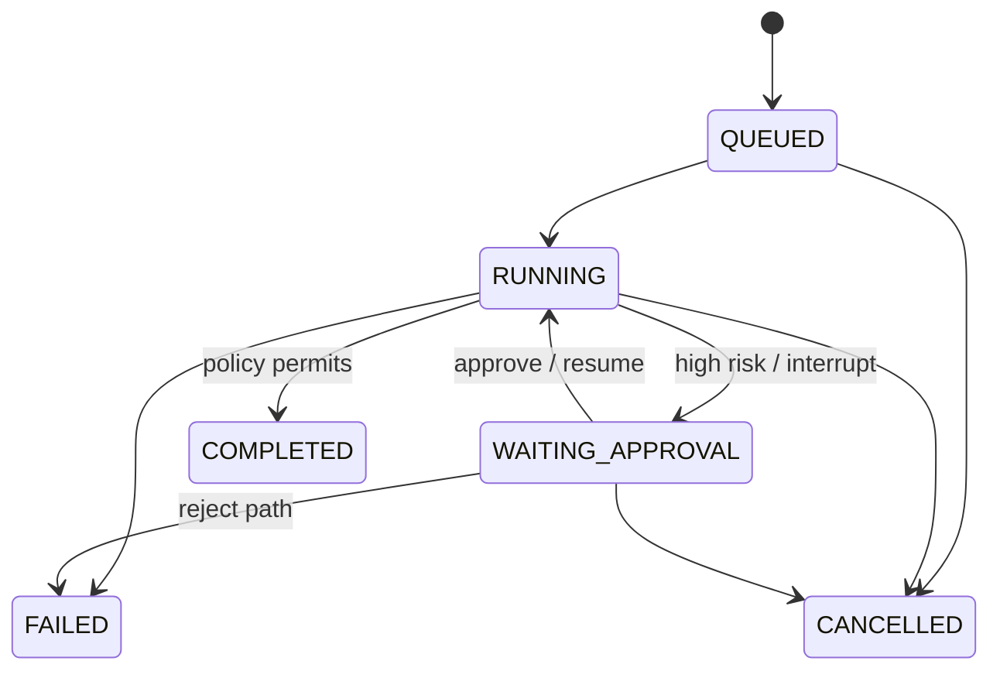

# State machine

The fixed graph is ingest → sensitivity classification → triage → risk analysis → policy evaluation → approval interrupt when required → finalise or reject. LLM output supplies evidence, never topology. Terminal states cannot transition. Approval is accepted only at `WAITING_APPROVAL`; LangGraph's checkpoint and command-resume primitive is the execution mechanism.
