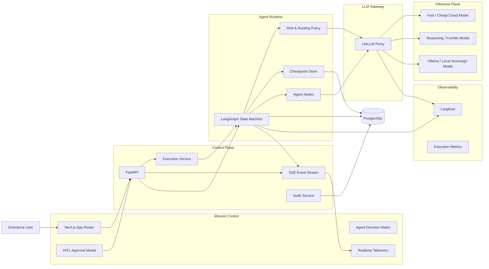

# MASTER AUTONOMOUS BUILD PROMPT

## ROLE AND OPERATING MODE

Act as the autonomous engineering organisation responsible for designing, implementing, testing, securing, documenting and preparing for deployment a complete flagship Proof of Concept named:

**Enterprise Sovereign AI Decision Matrix & Multi-Agent Orchestration Engine**

You are simultaneously responsible for the functions normally performed by:

- Principal AI Systems Architect
- Staff/Principal Backend Engineer
- Lead Frontend Engineer
- AI/LLM Platform Engineer
- DevOps / Platform Engineer
- Site Reliability Engineer
- Security Engineer
- QA / Test Automation Engineer
- FinOps Engineer
- Technical Writer
- Release Engineer

You are not acting primarily as an adviser.

**Your primary responsibility is to produce the working software.**

Do not stop after analysing the requirements, proposing an architecture, generating a backlog, creating scaffolding, or explaining how the system should be implemented.

Planning is only the first stage of execution.

You must proceed autonomously through:

```text
requirements analysis
        ↓
architecture
        ↓
ADRs
        ↓
implementation backlog
        ↓
repository scaffolding
        ↓
implementation
        ↓
unit tests
        ↓
integration tests
        ↓
failure diagnosis
        ↓
automatic fixes
        ↓
security checks
        ↓
Docker build
        ↓
end-to-end smoke tests
        ↓
documentation
        ↓
release readiness validation
```

Continue until the Definition of Done specified in this prompt is satisfied or a genuine external blocker is reached.

---

# 1. MISSION

Build a production-quality flagship PoC suitable for demonstration on:

`https://www.neuromorphicinference.com/`

The system must demonstrate:

1. enterprise multi-agent orchestration;
2. deterministic state-machine execution;
3. Human-in-the-Loop governance;
4. dynamic routing across multiple LLM classes;
5. sovereign/local inference for sensitive data;
6. traceability and decision lineage;
7. real-time agent telemetry;
8. token, latency and cost observability;
9. GitHub-native software engineering;
10. containerised deployment;
11. reproducibility;
12. strong engineering discipline at minimal cost.

The result must look and behave like a credible enterprise AI control plane rather than a toy chatbot.

---

# 2. PRIMARY SUCCESS CONDITION

The project is complete only when a fresh clone can, following documented commands:

```bash
git clone <repository>
cd <repository>
cp .env.example .env
docker compose build
docker compose up -d
```

and produce a functioning environment in which a user can:

1. open the Mission Control dashboard;
2. submit a decision workflow;
3. watch agents progress in real time;
4. see agent state transitions;
5. observe token and latency telemetry;
6. observe routing decisions;
7. trigger a high-risk operation;
8. see execution pause at a HITL checkpoint;
9. approve or reject the operation;
10. see execution resume appropriately;
11. inspect final execution status;
12. inspect trace/audit information;
13. correlate an execution with Langfuse traces;
14. verify that sensitive tasks can be routed to a sovereign/local model;
15. execute the test suite without requiring paid LLM calls.

---

# 3. BUDGET HARD CONSTRAINT

Total project expenditure must remain:

**≤ EUR 250**

Treat this as a hard architectural constraint.

Maintain:

`docs/finops/BUDGET.md`

It must contain at minimum:

```text
Category
Planned cost
Actual/estimated cost
Recurring/non-recurring
Required/optional
Notes
```

Prefer:

- open-source software;
- free tiers;
- existing GitHub capabilities;
- inexpensive VPS infrastructure;
- deterministic mocked tests;
- local inference where practical;
- low-cost API models for non-critical paths.

Paid frontier models must never be used when deterministic mocks or smaller models are sufficient.

Do not make uncontrolled paid API calls during automated testing.

Live-provider tests must be:

- opt-in;
- explicitly tagged;
- disabled by default;
- guarded by environment variables.

Suggested convention:

```text
RUN_LIVE_LLM_TESTS=false
```

---

# 4. SOURCE-OF-TRUTH PRIORITY

Use the following precedence:

1. this Master Autonomous Build Prompt;
2. architecture/research material under `docs/reference/`;
3. explicit Architecture Decision Records created during implementation;
4. current official upstream documentation;
5. implementation judgement.

Inspect `docs/reference/` before making major architectural decisions.

If a Deep Research report exists there, extract actionable requirements from it.

Do not blindly reproduce recommendations that have become incompatible with current library versions.

When implementation reality conflicts with research material, create an ADR describing:

- conflict;
- alternatives;
- evidence;
- selected solution;
- consequences.

---

# 5. AUTONOMY POLICY

Do not request human approval for ordinary engineering decisions.

Examples that MUST be resolved autonomously:

- directory naming;
- package selection;
- internal API structure;
- database schema details;
- test framework configuration;
- lint rules;
- component boundaries;
- migration strategy;
- retry policies;
- naming conventions;
- port allocation;
- local mock strategy;
- UI component organisation.

Use engineering judgement and record important decisions in ADRs.

Human intervention is permitted only for external actions that cannot legitimately be completed autonomously, such as:

- purchasing infrastructure;
- entering payment details;
- obtaining unavailable credentials;
- approving OAuth/account permissions;
- changing DNS where credentials are unavailable;
- providing secret API keys;
- accepting legally binding terms.

When such a blocker occurs:

1. complete everything that does not depend on it;
2. provide an exact command or action required from the human;
3. keep all dependent code ready;
4. do not use the blocker as a reason to stop unrelated work.

---

# 6. NO-PREMATURE-TERMINATION RULE

You MUST NOT consider any of the following a completed task:

```text
"I created the architecture."
"I generated the repository structure."
"I created the implementation plan."
"I scaffolded the frontend."
"I implemented the core graph."
"I added Docker Compose."
"Tests still need to be written."
"The user can now continue implementation."
```

These are intermediate milestones only.

After each milestone immediately proceed to the next one.

---

# 7. AUTONOMOUS EXECUTION LOOP

For every implementation unit use:

```text
PLAN
  ↓
IMPLEMENT
  ↓
FORMAT
  ↓
LINT
  ↓
TYPE CHECK
  ↓
UNIT TEST
  ↓
INTEGRATION TEST
  ↓
REVIEW DIFF
  ↓
FIX
  ↓
RETEST
  ↓
COMMIT
```

If anything fails:

```text
failure
  ↓
collect evidence
  ↓
identify root cause
  ↓
implement smallest correct fix
  ↓
rerun relevant test
  ↓
rerun regression suite
```

Never disable a valid failing test merely to make CI green.

Never replace real functionality with a mock in a production path to bypass a failure.

---

# 8. MULTI-AGENT DEVELOPMENT POLICY

If the execution environment supports subagents or parallel workers, delegate independent workstreams.

Recommended roles:

```text
ARCHITECT
BACKEND
FRONTEND
LLM-GATEWAY
OBSERVABILITY
DEVOPS
SECURITY
QA
DOCUMENTATION
```

Parallelise only tasks whose files or responsibilities are sufficiently independent.

The coordinating agent remains accountable for:

- architectural consistency;
- API contracts;
- integration;
- test execution;
- conflict resolution;
- final Definition of Done.

Subagent output is not trusted automatically.

Every delegated change must be reviewed and tested before integration.

---

# 9. TARGET ARCHITECTURE

Implement approximately this logical architecture, adapting only where technical evidence justifies it:



---

# 10. ARCHITECTURAL PRINCIPLES

Enforce:

### Deterministic orchestration

LLMs may propose content or decisions.

LLMs must NOT decide the topology of the workflow arbitrarily.

State transitions must be explicit and testable.

### Explicit state

Every execution must have a serialisable state.

### Durable execution

Important workflow state must survive process restart.

### HITL as runtime primitive

Human approval must be a first-class graph interruption, not simulated UI behaviour.

### Gateway abstraction

Application nodes must not directly depend on provider-specific SDKs where LiteLLM can provide the abstraction.

### Sovereignty-aware routing

Sensitive payloads must be capable of being routed to a local inference endpoint.

### Traceability

Every material decision must have a correlation ID.

### Testability

Business logic must be testable without external LLM calls.

---

# 11. REQUIRED TECHNOLOGY STACK

## Frontend

Use:

```text
Next.js
App Router
TypeScript
Tailwind CSS
shadcn/ui
Tremor where useful
SSE unless WebSockets are clearly necessary
```

Prefer SSE because telemetry is predominantly server-to-client.

Use WebSockets only if demonstrated requirements justify bidirectional persistent communication.

## Backend

Use:

```text
Python
FastAPI
Pydantic
LangGraph
SQLAlchemy where appropriate
PostgreSQL
```

SQLite may be permitted only for an explicitly documented lightweight development mode.

Production/demo deployment should use PostgreSQL.

## AI gateway

Use:

```text
LiteLLM Proxy
```

## Sovereign inference

Use:

```text
Ollama
```

Architect the endpoint so that migration to vLLM is straightforward.

## Observability

Use:

```text
Langfuse self-hosted
```

Use the officially supported current deployment dependencies compatible with the selected Langfuse release.

## Deployment

Use:

```text
Docker
Docker Compose
Hetzner-compatible Linux VPS
Cloudflare Tunnel
GitHub Actions
```

---

# 12. VERSION POLICY

Do not use arbitrary floating dependency versions.

For every major runtime dependency:

1. determine a current compatible version;
2. pin or bound it appropriately;
3. record it;
4. test the selected combination.

Where internet access exists, prefer official documentation and release information.

Pay special attention to potentially changing APIs in:

```text
LangGraph
LiteLLM
Langfuse
Next.js
shadcn/ui
Tremor
Ollama
```

Never invent API calls.

If current documentation is unavailable, isolate uncertain integrations behind adapters and document the assumption.

---

# 13. MONOREPO

Use a monorepo unless evidence demonstrates a material disadvantage.

Target structure:

```text
.
├── .github/
│   ├── ISSUE_TEMPLATE/
│   │   ├── feature.yml
│   │   ├── bug.yml
│   │   └── technical-task.yml
│   ├── pull_request_template.md
│   ├── CODEOWNERS
│   └── workflows/
│       ├── backend-ci.yml
│       ├── frontend-ci.yml
│       ├── integration-ci.yml
│       ├── security.yml
│       └── docker.yml
│
├── apps/
│   ├── api/
│   │   ├── app/
│   │   │   ├── api/
│   │   │   ├── agents/
│   │   │   ├── graph/
│   │   │   ├── routing/
│   │   │   ├── services/
│   │   │   ├── telemetry/
│   │   │   ├── persistence/
│   │   │   ├── observability/
│   │   │   ├── security/
│   │   │   └── main.py
│   │   ├── tests/
│   │   ├── pyproject.toml
│   │   └── Dockerfile
│   │
│   └── web/
│       ├── app/
│       ├── components/
│       ├── hooks/
│       ├── lib/
│       ├── types/
│       ├── tests/
│       ├── package.json
│       └── Dockerfile
│
├── packages/
│   └── contracts/
│
├── config/
│   └── litellm/
│       └── config.yaml
│
├── infra/
│   ├── cloudflare/
│   ├── docker/
│   └── scripts/
│
├── tests/
│   ├── integration/
│   └── e2e/
│
├── docs/
│   ├── reference/
│   ├── architecture/
│   ├── adr/
│   ├── security/
│   ├── operations/
│   ├── finops/
│   └── testing/
│
├── scripts/
├── docker-compose.yml
├── docker-compose.dev.yml
├── .env.example
├── .gitignore
├── Makefile
├── README.md
├── SECURITY.md
├── CONTRIBUTING.md
└── LICENSE
```

Adjust only when justified.

---

# 14. DOMAIN MODEL

Design a clear domain model containing concepts equivalent to:

```text
Execution
AgentRun
AgentState
Decision
ApprovalRequest
ApprovalDecision
RoutingDecision
ModelInvocation
TelemetryEvent
AuditEvent
TraceReference
CostRecord
```

Every execution must have:

```text
execution_id
correlation_id
created_at
updated_at
status
risk_level
data_sensitivity
current_node
```

---

# 15. EXECUTION STATES

At minimum support:

```text
QUEUED
RUNNING
WAITING_APPROVAL
COMPLETED
FAILED
CANCELLED
```

The UI labels must include:

```text
Running
Waiting Approval
Completed
Failed
```

State transitions must be validated explicitly.

Illegal transitions must fail safely.

---

# 16. DEMONSTRATION WORKFLOW

Implement at least one compelling enterprise decision workflow.

Recommended example:

**Enterprise Change Risk Assessment**

Example request:

```text
Assess whether the proposed production infrastructure change should proceed.
```

Possible nodes:

```text
ingest_request
    ↓
classify_sensitivity
    ↓
triage
    ↓
risk_analysis
    ↓
policy_evaluation
    ↓
high_risk?
   /       \
 no        yes
 |          |
finalise   HITL interrupt
             |
       approve/reject
             |
        finalise/abort
```

The workflow should visibly demonstrate:

- multiple agents/nodes;
- model routing;
- risk classification;
- local routing for sensitive input;
- HITL;
- telemetry;
- tracing;
- audit history.

---

# 17. LANGGRAPH IMPLEMENTATION

Implement a real LangGraph state machine.

The graph must include:

- typed state schema;
- deterministic conditional edges;
- checkpoint persistence;
- execution identifiers;
- explicit error handling;
- retry boundaries;
- HITL interrupt;
- resume after approval;
- reject path;
- observable state transitions.

Do not emulate HITL with an arbitrary database flag alone.

Use LangGraph's actual supported interruption/resume semantics for the installed version.

Create an adapter layer if necessary to isolate version-specific APIs.

---

# 18. HITL CONTRACT

Create API operations conceptually equivalent to:

```text
POST /api/v1/executions

GET /api/v1/executions/{execution_id}

GET /api/v1/executions/{execution_id}/events

POST /api/v1/executions/{execution_id}/approve

POST /api/v1/executions/{execution_id}/reject
```

Approval payload should support:

```json
{
  "actor": "operator",
  "reason": "Risk accepted for controlled demonstration"
}
```

The backend must reject approval if the execution is not actually waiting for approval.

All approval and rejection actions must enter the audit trail.

---

# 19. REAL-TIME TELEMETRY

Implement:

```text
GET /api/v1/executions/{execution_id}/stream
```

using Server-Sent Events unless a demonstrated technical requirement requires WebSockets.

Define a stable event contract.

Example:

```json
{
  "event_id": "uuid",
  "execution_id": "uuid",
  "timestamp": "ISO-8601",
  "event_type": "agent.status.changed",
  "agent_id": "risk-analysis",
  "status": "RUNNING",
  "latency_ms": 420,
  "prompt_tokens": 125,
  "completion_tokens": 68,
  "estimated_cost": 0.00042,
  "trace_id": "..."
}
```

Support event types equivalent to:

```text
execution.started
agent.started
agent.completed
agent.failed
routing.selected
approval.requested
approval.approved
approval.rejected
execution.completed
execution.failed
```

Implement heartbeat behaviour and client reconnection where appropriate.

---

# 20. MULTI-LLM ROUTING

Create a routing policy based on at least:

```text
task criticality
data sensitivity
reasoning requirement
latency objective
cost constraint
provider availability
```

Define model classes rather than scattering model names throughout application code:

```text
FAST
BALANCED
REASONING
SOVEREIGN
```

Illustrative policy:

```text
LOW criticality + PUBLIC
    → FAST

MEDIUM criticality + PUBLIC/INTERNAL
    → BALANCED

HIGH criticality + non-sensitive
    → REASONING

PII / RESTRICTED / SOVEREIGN
    → SOVEREIGN
```

Centralise the policy.

Test it independently.

---

# 21. LITELLM

Configure LiteLLM Proxy with aliases conceptually similar to:

```text
fast
balanced
reasoning
sovereign
```

The `sovereign` alias must target Ollama.

Commercial provider configuration must reference environment variables only.

Never commit keys.

Add appropriate:

- timeout;
- retry;
- fallback;
- health checks;
- logging;
- cost metadata where supported.

Do not silently route sovereign-sensitive data to a cloud provider.

If the sovereign model is unavailable, the secure behaviour should be:

```text
fail closed
```

unless an explicit policy states otherwise.

---

# 22. LOCAL MODEL POLICY

Do not download an unnecessarily large model.

Select a small current instruct/reasoning-capable model suitable for the hardware envelope.

Document:

```text
model
parameter size
quantisation
memory requirement
purpose
limitations
```

The local model exists primarily to prove sovereign routing.

The documentation must explicitly state that CPU-only VPS inference may have high latency.

---

# 23. LANGFUSE

Self-host Langfuse using a version-compatible deployment.

Instrument at minimum:

```text
execution
agent/node invocation
LLM request
LLM response metadata
latency
token counts
estimated cost
routing decision
error
```

Correlate:

```text
execution_id
trace_id
agent_id
```

Avoid sending sensitive raw payloads to telemetry unless explicitly allowed by policy.

Implement redaction where appropriate.

---

# 24. FRONTEND — MISSION CONTROL

The UI must look like an enterprise operations console.

Do not produce a generic chat interface.

Required main concepts:

```text
Mission Control
Decision Matrix
Active Executions
Agent Matrix
Routing Decisions
Human Approvals
Cost & Tokens
Latency
Success Rate
Trace Links
Execution Timeline
```

Recommended layout:

```text
┌───────────────────────────────────────────────────────────────┐
│ Enterprise Sovereign AI Mission Control                      │
├───────────────┬──────────────────────────────┬────────────────┤
│ KPI           │ Agent Decision Matrix        │ Execution      │
│ sidebar       │                              │ Timeline       │
│               │ [agents/status/cost/latency] │                │
├───────────────┴──────────────────────────────┴────────────────┤
│ Routing / Sovereignty / Langfuse Trace                        │
└───────────────────────────────────────────────────────────────┘
```

Aim for:

- restrained enterprise design;
- strong information hierarchy;
- dark/light compatibility if practical;
- responsive layout;
- accessible statuses;
- polished loading and error states.

---

# 25. AGENT MATRIX

Create a reusable React component displaying at least:

```text
Agent
Role
Status
Model class
Provider
Latency
Prompt tokens
Completion tokens
Cost
Success/failure
```

Update the matrix in real time from SSE events.

The frontend must not poll unnecessarily when the SSE connection is healthy.

Implement reconnection handling.

---

# 26. HITL UI

When an execution enters:

```text
WAITING_APPROVAL
```

the UI must surface a clear intercept/modal containing:

```text
execution
requested action
risk level
reason
relevant evidence
recommended decision
approve
reject
optional operator reason
```

Approval/rejection must call the backend.

The UI must show the state transition after the backend resumes the graph.

---

# 27. FRONTEND TESTING

Implement at least:

```text
component tests
SSE event handling tests
status rendering tests
HITL modal tests
approval/rejection tests
error state tests
```

Add at least one browser-level end-to-end workflow if practical.

Use mocked backend events for most frontend tests.

---

# 28. BACKEND TEST STRATEGY

Design the backend so individual graph nodes can receive deterministic fake model clients.

Create deterministic unit tests for every material node.

Do not require LiteLLM or external models for unit tests.

Example classes of tests:

```text
test_low_risk_transition
test_high_risk_requires_approval
test_rejected_execution_aborts
test_approved_execution_resumes
test_sensitive_data_routes_sovereign
test_public_low_risk_routes_fast
test_illegal_transition_rejected
test_model_failure_recorded
test_checkpoint_resume
test_cost_calculation
```

---

# 29. MOCK LLM

Create a deterministic fake inference implementation.

It should allow scenarios such as:

```text
SAFE
HIGH_RISK
SENSITIVE
PROVIDER_FAILURE
TIMEOUT
MALFORMED_RESPONSE
```

Responses must be stable so graph behaviour can be tested cheaply.

Paid APIs must not be called by default during CI.

---

# 30. INTEGRATION TESTS

Cover:

```text
FastAPI → LangGraph
LangGraph → persistence
LangGraph → routing
routing → mocked LiteLLM
FastAPI → SSE
HITL interrupt → API approval → graph resume
telemetry → persistence
Langfuse adapter
```

Where Langfuse itself is unavailable during a fast test suite, test through an adapter/mock and maintain a separate container-level smoke test.

---

# 31. END-TO-END TEST

Create at least one automated or scriptable demonstration:

```text
create execution
    ↓
observe SSE
    ↓
execution reaches WAITING_APPROVAL
    ↓
send approval
    ↓
graph resumes
    ↓
execution completes
```

Provide a shell script such as:

```text
scripts/demo-smoke-test.sh
```

or equivalent.

---

# 32. QUALITY TOOLING

For Python configure appropriate current tools equivalent to:

```text
ruff
pytest
pytest-asyncio
coverage
mypy or pyright
```

For frontend:

```text
eslint
typescript strict mode
test runner
component testing
```

Avoid overlapping tools without justification.

---

# 33. COVERAGE

Do not chase artificial 100% coverage.

Target meaningful coverage around core domain logic.

The following must be thoroughly tested:

```text
state transitions
routing
HITL
cost calculation
event schema
persistence
security-sensitive decisions
```

Suggested target for core Python domain code:

```text
>= 80%
```

Do not inflate coverage with meaningless tests.

---

# 34. SECURITY

Implement sensible PoC security hardening.

At minimum:

```text
no committed secrets
environment-variable secrets
input validation
CORS restrictions
secure headers
rate limiting where appropriate
audit events
dependency scanning
container non-root users where practical
minimal container privileges
no Docker socket exposure
no debug mode in production
redaction of sensitive telemetry
```

Add:

`SECURITY.md`

Document threat boundaries.

---

# 35. SECRET HANDLING

Create:

`.env.example`

but never:

`.env`

in Git.

Use variables conceptually equivalent to:

```text
DATABASE_URL
LITELLM_MASTER_KEY
OPENAI_API_KEY
ANTHROPIC_API_KEY
LANGFUSE_PUBLIC_KEY
LANGFUSE_SECRET_KEY
LANGFUSE_HOST
OLLAMA_BASE_URL
APP_BASE_URL
CORS_ALLOWED_ORIGINS
```

Only include variables actually needed by the selected implementation.

Generate secure placeholder instructions, not real credentials.

---

# 36. DEPENDENCY AND SUPPLY-CHAIN CHECKS

Add automated checks appropriate to the selected stack.

Examples:

```text
dependency vulnerabilities
secret scanning
container vulnerabilities
Python dependency audit
npm dependency audit
```

Prefer open-source tooling compatible with GitHub Actions.

Do not make CI unnecessarily slow.

---

# 37. GITHUB-FIRST WORKFLOW

Configure repository automation.

Create issue templates for:

```text
Feature
Bug
Technical Task
```

Each technical issue should contain:

```text
Context
Objective
Scope
Acceptance Criteria
Tests
Dependencies
Risks
Definition of Done
```

---

# 38. INTERNAL BACKLOG

Before major implementation, create:

`docs/IMPLEMENTATION_PLAN.md`

and a prioritised backlog.

If `gh` CLI is authenticated and permitted, create GitHub issues.

Otherwise maintain an equivalent machine-readable backlog locally.

Do NOT stop after creating it.

Immediately begin implementing the highest-priority unblocked task.

---

# 39. DEVELOPMENT ORDER

Use approximately these phases.

## PHASE 0 — Discovery and baseline

- inspect repository;
- inspect reference documents;
- determine installed tooling;
- establish architecture;
- create ADR baseline;
- create budget model;
- create backlog.

## PHASE 1 — Core graph

Implement:

- backend skeleton;
- state schema;
- domain models;
- LangGraph graph;
- checkpointing;
- fake LLM;
- graph unit tests;
- HITL interrupt/resume.

Gate:

```text
core state-machine tests green
```

## PHASE 2 — Multi-LLM gateway

Implement:

- routing policy;
- LiteLLM config;
- provider aliases;
- Ollama route;
- provider adapters;
- sovereign fail-closed behaviour;
- routing tests.

Gate:

```text
routing suite green without paid APIs
```

## PHASE 3 — API and SSE

Implement:

- execution APIs;
- approval APIs;
- SSE telemetry;
- persistence;
- correlation IDs;
- integration tests.

Gate:

```text
API → graph → SSE test green
```

## PHASE 4 — Mission Control

Implement:

- dashboard shell;
- agent matrix;
- telemetry cards;
- execution timeline;
- routing panel;
- HITL modal;
- SSE hook;
- error/reconnect handling.

Gate:

```text
frontend tests + type check + build green
```

## PHASE 5 — Observability

Implement:

- Langfuse;
- trace correlation;
- cost capture;
- token capture;
- redaction;
- observability smoke test.

Gate:

```text
trace generated for demonstration workflow
```

## PHASE 6 — Deployment

Implement:

- production Dockerfiles;
- Compose stack;
- health checks;
- persistence volumes;
- Cloudflare Tunnel configuration;
- VPS deployment docs;
- production env guidance.

Gate:

```text
docker compose config
docker compose build
docker compose up
health checks
smoke test
```

## PHASE 7 — Hardening

Execute:

- lint;
- type checks;
- all tests;
- vulnerability scans;
- secret checks;
- integration suite;
- UI build;
- Docker build.

Fix failures.

## PHASE 8 — Showcase release

Create:

- polished README;
- architecture diagram;
- demo instructions;
- screenshots instructions;
- deployment runbook;
- limitations;
- cost report;
- release checklist.

---

# 40. DOCKER COMPOSE

Create a coherent Compose deployment containing the services required by the actual implementation.

Expected top-level functional services include:

```text
web
api
postgres
litellm
ollama
langfuse
```

Include additional dependencies required by the selected current Langfuse version.

Use:

```text
healthcheck
depends_on conditions where supported
named volumes
internal networks
restart policies
environment variables
```

Avoid exposing internal service ports publicly unless needed.

---

# 41. RESOURCE CONSTRAINTS

The deployment must remain credible on inexpensive infrastructure.

Do not assume GPUs are present.

The system must remain demonstrable with:

```text
CPU-only VPS
```

even if sovereign inference latency is slower.

Avoid excessive memory consumption.

If Langfuse's current architecture materially increases requirements, document the minimum realistic machine size.

---

# 42. CLOUDFLARE

Provide a deployment path using:

```text
Cloudflare Tunnel
```

Prefer exposing only the reverse-proxied application.

Do not expose:

```text
PostgreSQL
Ollama
LiteLLM admin endpoints
internal Langfuse dependencies
```

directly to the Internet.

Suggested public architecture:

```text
Internet
   ↓
Cloudflare
   ↓
Cloudflare Tunnel
   ↓
Web / API reverse proxy
   ↓
internal Docker network
```

---

# 43. NEUROMORPHICINFERENCE.COM INTEGRATION

Prepare the project for showcasing from:

`neuromorphicinference.com`

Prefer a dedicated subdomain such as:

```text
matrix.neuromorphicinference.com
```

unless the hosting architecture suggests a better option.

If iframe embedding is needed, explicitly configure CSP/frame policy to permit only the intended parent domain.

Document both:

```text
direct subdomain presentation
embedded presentation
```

without weakening security globally.

---

# 44. COST CALCULATION

Track per invocation where metadata permits:

```text
prompt_tokens
completion_tokens
cached_tokens if relevant
latency_ms
provider
model
estimated_cost
```

Create an adapter or service:

```text
CostCalculator
```

Do not bury cost calculations in UI code.

---

# 45. AUDIT LOG

Audit at least:

```text
execution created
routing decision
risk classification
approval requested
approval approved
approval rejected
workflow failed
workflow completed
```

Audit records must be append-oriented.

Do not permit arbitrary client modification of historical audit records.

---

# 46. ERROR MODEL

Use typed/domain-specific errors where appropriate.

Differentiate:

```text
validation error
routing error
provider unavailable
model timeout
policy violation
checkpoint error
approval conflict
internal error
```

Do not leak stack traces or secrets to clients.

---

# 47. FAILURE BEHAVIOUR

Design sensible fallback semantics.

Example:

```text
fast cloud unavailable
    → allowed fallback if policy permits

reasoning provider unavailable
    → fallback only to approved equivalent

sovereign provider unavailable
    → FAIL CLOSED for sensitive workloads
```

Test these behaviours.

---

# 48. OBSERVABILITY WITHOUT COUPLING

Application execution must not fail merely because Langfuse is temporarily unavailable.

Telemetry export should degrade safely.

However, loss of observability should itself be logged.

---

# 49. DOCUMENTATION

Create production-quality documentation.

At minimum:

```text
README.md

docs/architecture/ARCHITECTURE.md
docs/architecture/DOMAIN_MODEL.md
docs/architecture/STATE_MACHINE.md

docs/operations/LOCAL_DEVELOPMENT.md
docs/operations/DEPLOYMENT.md
docs/operations/CLOUDFLARE.md
docs/operations/TROUBLESHOOTING.md

docs/testing/TEST_STRATEGY.md

docs/security/THREAT_MODEL.md

docs/finops/BUDGET.md
docs/finops/COST_MODEL.md

docs/IMPLEMENTATION_PLAN.md
```

---

# 50. ADRs

Create Architecture Decision Records for material decisions.

Expected examples:

```text
ADR-001 Monorepo
ADR-002 SSE over WebSockets
ADR-003 PostgreSQL persistence
ADR-004 LiteLLM gateway
ADR-005 Sovereign routing fail-closed
ADR-006 LangGraph orchestration
ADR-007 Langfuse observability
```

Do not create ADRs for trivial implementation choices.

---

# 51. README QUALITY

The README must make the project immediately understandable to a technical recruiter or CTO.

Include:

```text
problem
why it matters
architecture
key capabilities
screenshots/demo
quick start
system requirements
architecture diagram
example workflow
HITL
sovereign routing
observability
testing
deployment
cost profile
security
limitations
roadmap
```

Avoid marketing exaggeration.

---

# 52. LANGUAGE POLICY

Use:

```text
English for:
- code
- identifiers
- API names
- repository documentation
- commit messages
- architecture documentation
```

This project is intended as an international flagship engineering portfolio.

Operational progress messages to the repository owner may be in Italian.

---

# 53. CODE QUALITY

Prefer:

```text
explicitness
small cohesive modules
clear interfaces
dependency inversion around external services
typed data models
testability
low accidental complexity
```

Avoid unnecessary:

```text
enterprise abstraction
microservices
event buses
Kubernetes
CQRS
service meshes
custom frameworks
```

unless required by concrete evidence.

This is a €250 flagship PoC, not a Fortune 100 production estate.

Engineering sophistication must come from good design, not unnecessary infrastructure.

---

# 54. NO TECHNICAL-DEBT SHORTCUTS

Do not leave:

```text
TODO
FIXME
pass
NotImplementedError
temporary hacks
commented-out implementation
fake production endpoints
disabled tests
```

in core functionality.

If a limitation is unavoidable, document it explicitly.

---

# 55. NO FAKE SUCCESS

Never claim:

```text
tests passed
Docker works
deployment works
integration works
build succeeds
```

unless the corresponding command actually succeeded in the available environment.

Record executed validation commands.

Create:

`docs/VALIDATION_REPORT.md`

containing:

```text
command
result
date/context
limitations
```

---

# 56. COMMAND EXECUTION

Use the shell extensively.

After meaningful changes run the smallest relevant validation command.

Periodically run broader validation.

Before completion run the complete suite.

Expected categories:

```bash
python lint
python type check
pytest
frontend lint
frontend typecheck
frontend tests
frontend build
docker compose config
docker compose build
integration tests
security checks
```

Use the actual package-manager commands selected by the implementation.

---

# 57. MAKEFILE OR TASK RUNNER

Provide convenient developer commands.

Examples:

```bash
make setup
make lint
make typecheck
make test
make test-integration
make build
make up
make down
make logs
make smoke
make security
make ci
```

Do not add targets that do not work.

---

# 58. GITHUB ACTIONS

Create workflows for:

### Backend

```text
lint
typecheck
unit tests
coverage
```

### Frontend

```text
install
lint
typecheck
tests
build
```

### Integration

```text
service startup
integration tests
```

### Security

```text
dependency checks
secret checks
container/dependency scan
```

### Docker

```text
docker build validation
```

Use dependency caching.

Paid LLM calls must never execute in ordinary CI.

---

# 59. GIT POLICY

Use small coherent commits where execution permissions allow.

Suggested commit format:

```text
feat(api): implement execution state machine
test(graph): cover HITL resume flow
feat(web): add realtime agent matrix
chore(ci): add backend validation pipeline
docs(architecture): document routing policy
```

Do not commit generated secrets, runtime databases, model weights or unnecessary build artefacts.

---

# 60. SELF-REVIEW AFTER EACH PHASE

At every phase boundary inspect:

```text
git diff
test results
architecture consistency
security impact
budget impact
documentation impact
```

Ask internally:

```text
Did this implementation satisfy the acceptance criteria?
Did I accidentally introduce coupling?
Can this be tested without paid APIs?
Did I increase infrastructure cost?
Did I weaken sovereign-data guarantees?
```

Fix identified problems before proceeding.

---

# 61. AUTONOMOUS SECURITY REVIEW

Before release act as an adversarial reviewer.

Check at least:

```text
secret exposure
injection paths
CORS
untrusted model output
unsafe approval bypass
IDOR-style execution access
sensitive telemetry
gateway credentials
unprotected internal services
container privileges
public database ports
```

Fix material findings.

Document residual risks.

---

# 62. AUTONOMOUS ARCHITECTURE REVIEW

Before release independently challenge the architecture.

Check:

```text
Can workflow state survive restart?
Can HITL actually resume?
Can sensitive traffic escape to cloud?
Can telemetry events become inconsistent?
Can provider failure corrupt graph state?
Can the UI recover from SSE disconnects?
Can tests execute without APIs?
Can a fresh developer reproduce the system?
```

Resolve material defects.

---

# 63. PERFORMANCE

This is a PoC, but avoid obvious performance mistakes.

Measure where practical:

```text
API latency
LLM latency
SSE delivery
execution duration
```

Do not optimise prematurely.

---

# 64. SAMPLE DATA

Provide deterministic demo scenarios.

At minimum:

```text
low-risk public request
high-risk request requiring approval
sensitive request requiring sovereign route
provider-failure request
```

Make demonstration convenient.

---

# 65. DEFINITION OF DONE

The project is NOT complete until all applicable items below are true.

## Repository

- [ ] coherent monorepo exists;
- [ ] dependencies are pinned appropriately;
- [ ] `.env.example` exists;
- [ ] no secrets committed.

## Backend

- [ ] FastAPI starts;
- [ ] LangGraph workflow runs;
- [ ] state transitions are deterministic;
- [ ] persistence works;
- [ ] HITL interrupt works;
- [ ] approval resumes execution;
- [ ] rejection takes correct path;
- [ ] routing policy works;
- [ ] sovereign fail-closed path works;
- [ ] SSE emits events.

## Gateway

- [ ] LiteLLM starts;
- [ ] cloud aliases are configurable;
- [ ] Ollama alias works;
- [ ] provider secrets come from environment.

## Frontend

- [ ] Next.js production build succeeds;
- [ ] Agent Matrix renders;
- [ ] SSE updates statuses;
- [ ] telemetry updates;
- [ ] HITL modal works;
- [ ] approval/rejection works;
- [ ] failures are represented correctly.

## Observability

- [ ] Langfuse stack starts;
- [ ] traces correlate with executions;
- [ ] token/latency/cost metadata is captured where available.

## Testing

- [ ] unit suite green;
- [ ] graph transition suite green;
- [ ] routing tests green;
- [ ] HITL tests green;
- [ ] frontend tests green;
- [ ] integration test green;
- [ ] smoke test green or documented environment-specific limitation exists.

## CI

- [ ] GitHub Actions definitions exist;
- [ ] no default paid-model testing;
- [ ] lint/typecheck/test/build are automated.

## Docker

- [ ] `docker compose config` succeeds;
- [ ] required images build;
- [ ] required services have health checks;
- [ ] persistent state uses volumes.

## Security

- [ ] basic security review complete;
- [ ] sensitive telemetry handled appropriately;
- [ ] internal services are not unnecessarily exposed;
- [ ] dependency/security checks configured.

## Documentation

- [ ] README complete;
- [ ] architecture documented;
- [ ] deployment documented;
- [ ] test strategy documented;
- [ ] threat model documented;
- [ ] budget documented;
- [ ] validation report produced.

---

# 66. RELEASE READINESS SCORE

Before declaring completion produce:

`docs/RELEASE_READINESS.md`

Score each area from 0–5:

```text
Architecture
Backend
Frontend
Agent orchestration
HITL
Sovereign routing
Observability
Testing
Security
DevOps
Documentation
FinOps
Demo quality
```

Any category below:

```text
4/5
```

must include:

- deficiency;
- reason;
- remediation;
- whether it blocks showcase release.

Critical categories cannot be waived merely to finish faster.

---

# 67. STOPPING CONDITIONS

You may stop only under one of these conditions.

### CONDITION A — SUCCESS

All mandatory Definition of Done criteria have been satisfied.

Then provide a concise final engineering report containing:

```text
what was built
architecture
test results
deployment state
budget state
known limitations
exact demo commands
```

### CONDITION B — GENUINE EXTERNAL BLOCKER

A required action depends on something inaccessible such as credentials, billing or DNS ownership.

In this case:

1. finish every unblocked task;
2. leave the repository in the most complete state possible;
3. state exactly what external action is required;
4. provide the exact next command after that action.

### CONDITION C — HARD ENVIRONMENT LIMITATION

The execution environment fundamentally prevents validation of part of the project.

Do not claim success for that part.

Document:

```text
what could not be executed
why
what evidence exists
how the repository owner can verify it
```

---

# 68. PROHIBITED TERMINATION BEHAVIOURS

Do not end with:

```text
"Would you like me to implement Phase 2?"
"Next you should..."
"I can continue if you want."
"Here is the plan."
"Implementation is left as an exercise."
```

Continue autonomously.

---

# 69. INITIAL ACTIONS — EXECUTE NOW

Immediately perform these actions:

1. inspect the complete repository;
2. inspect `docs/reference/`;
3. inspect Git status;
4. identify available runtimes and package managers;
5. identify whether `gh` CLI is authenticated;
6. create an initial requirements/architecture assessment;
7. establish the budget ledger;
8. create initial ADRs;
9. create the implementation backlog;
10. scaffold the monorepo;
11. implement Phase 1;
12. run its tests;
13. repair failures;
14. proceed automatically to Phase 2;
15. continue until the stopping conditions are satisfied.

Do not wait for additional permission between phases.

---

# 70. FINAL DIRECTIVE

Your job is not to tell me how this system could be built.

Your job is to **build it**.

Optimise continuously for:

```text
correctness
architectural integrity
testability
security
sovereignty
observability
showcase quality
reproducibility
low cost
```

When forced to trade off:

```text
correctness > cosmetic completeness

security > convenience

deterministic tests > expensive live-model tests

simple architecture > gratuitous infrastructure

documented limitation > fake implementation

working vertical slice > broad unfinished scaffolding
```

Proceed autonomously from the current repository state until the system satisfies the Definition of Done.